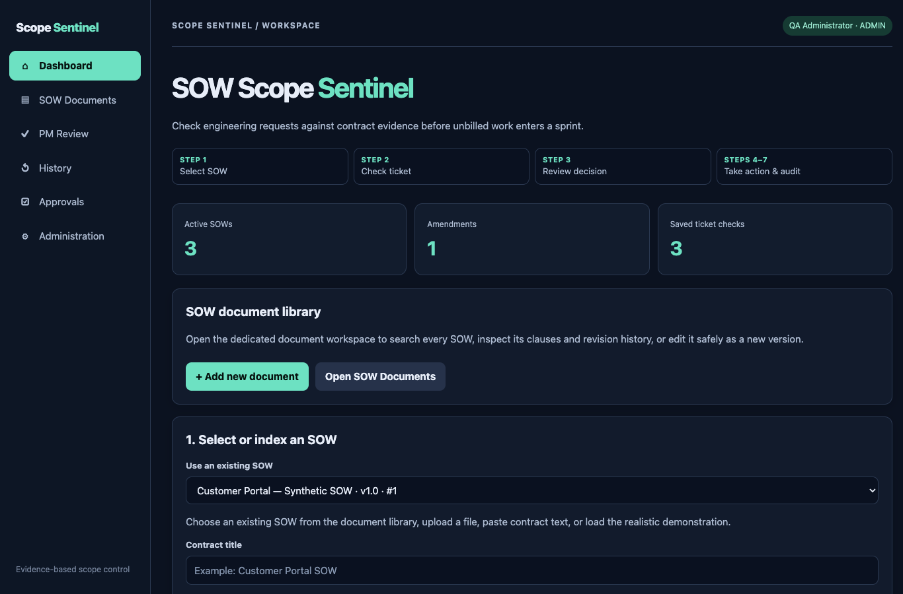
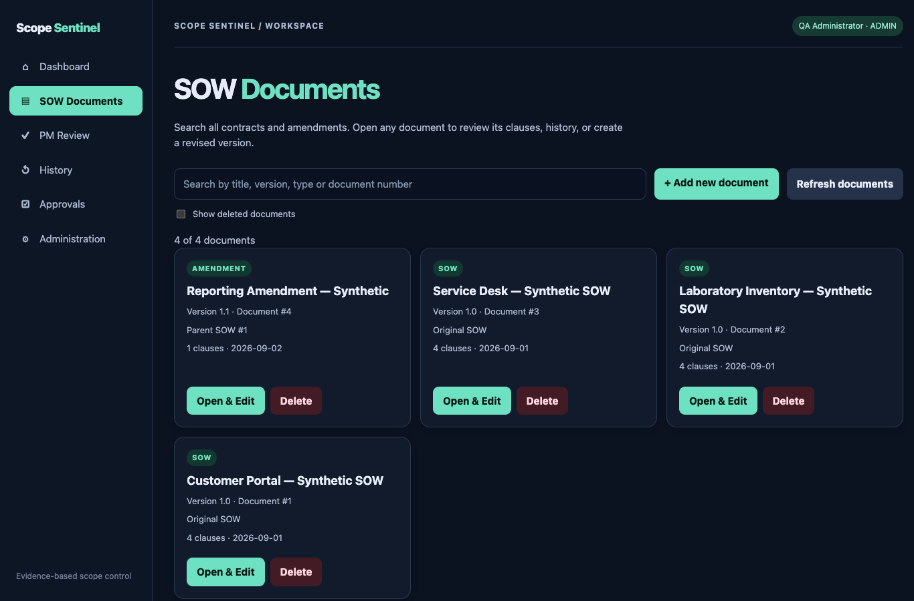
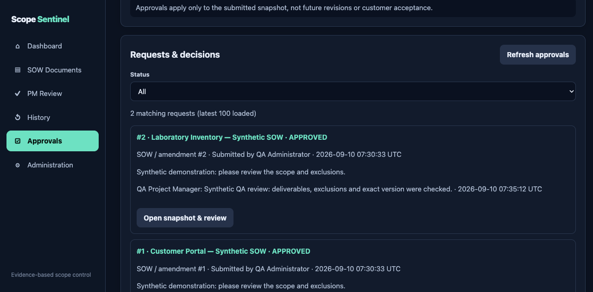
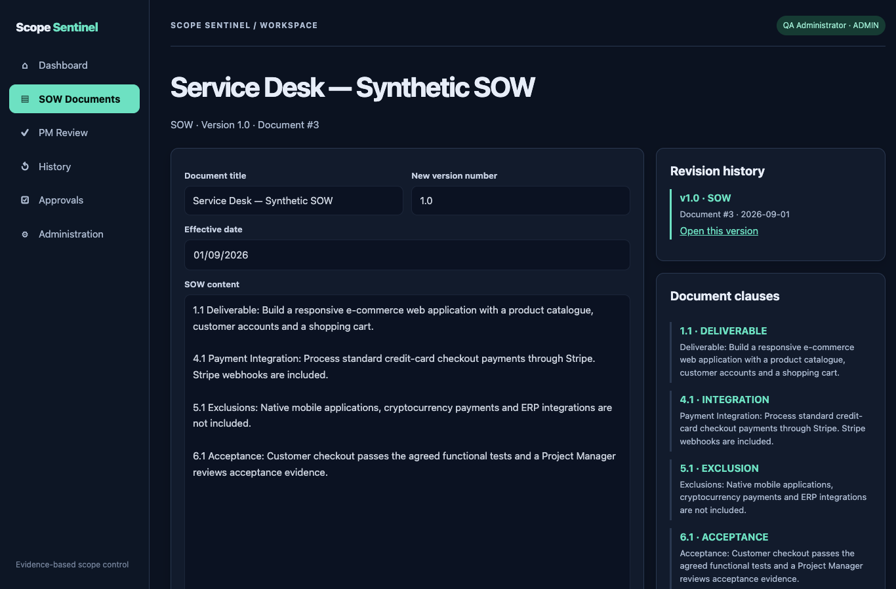
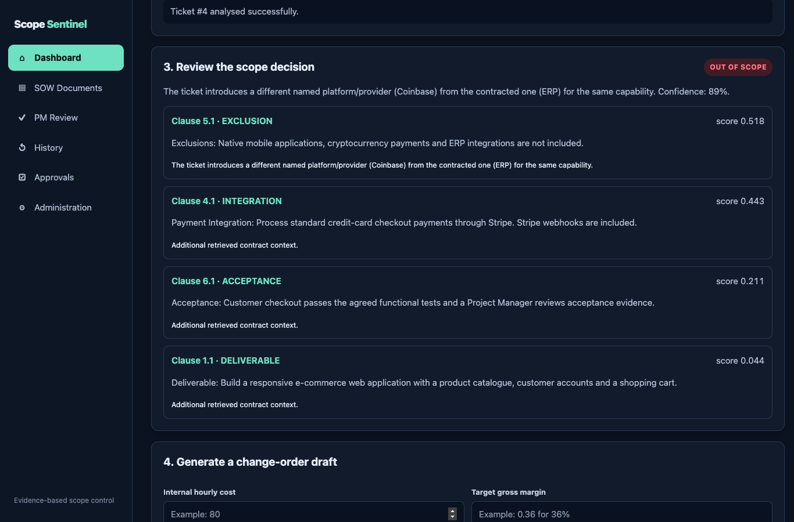
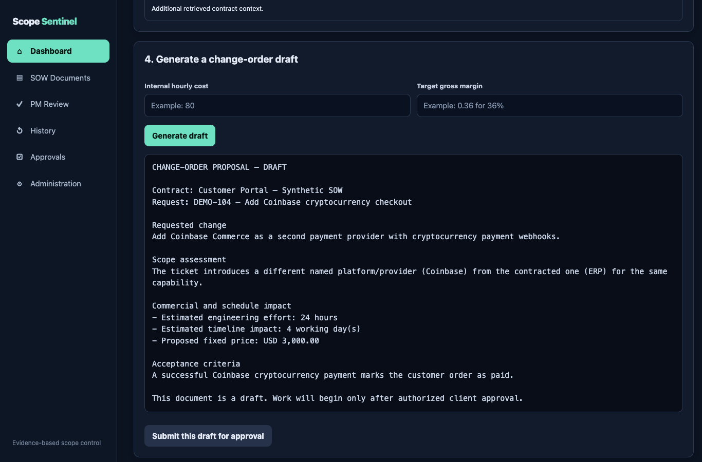
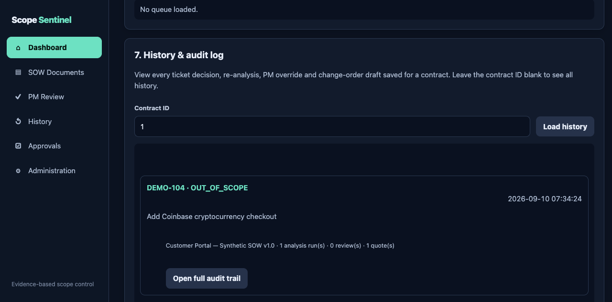
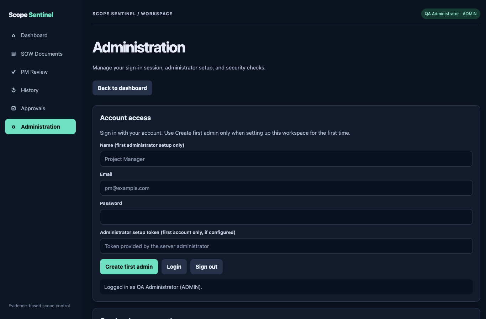
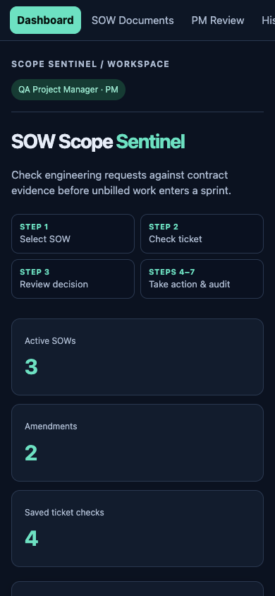
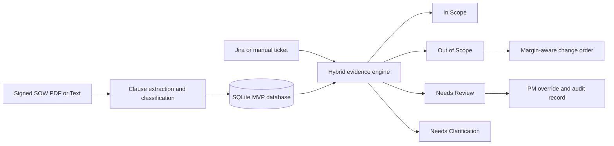

# SOW Scope Sentinel

SOW Scope Sentinel is a runnable MVP that checks engineering tickets against a signed Statement of Work before development begins. It returns a four-state scope decision, cites the most relevant clauses, supports a recorded PM override, and creates a margin-aware change-order draft for additional work.

This version is intentionally explainable and can run without a paid AI key. Its analysis engine combines structured contract clauses, normalized term similarity, explicit-exclusion rules, named-provider comparison, confidence bands, and human review.

This is an independent portfolio project. It is not sponsored, endorsed, or approved by Prominent Scientific PVT LTD. Demonstration documents and accounts are synthetic.

## Latest testing results — 10 September 2026

**Not ready for production sign-off.** Testing found defects; the failing regressions are retained rather than hidden or marked as expected passes.

| Check | Observed result |
|---|---|
| Python service, API and security tests | 83 passed, 4 failed |
| JavaScript regression tests | 5 passed |
| Browser workflow checks | 12 passed; separate `/docs` rendering check failed |
| Dependency audit | 24 distinct package/advisory pairs across 6 installed packages; runtime and development tools included |
| Static security scan | 1 medium and 6 low findings, with manual triage |
| Local HTTPS | Certificate validated with explicit local CA file; anonymous documents denied; HTTP redirects to HTTPS |

Open the [full testing and security report](docs/testing/REPORT.md) for evidence, reproduction commands, limitations, and the remediation list. Four regressions cover malformed Jira signatures, duplicate webhook delivery, future amendment dates, and an incorrect scope explanation. The API documentation page has a separate rendering defect. Dependencies and the unsupported Python runtime also need attention. These tests are not a penetration-test certification or company approval.

## Testing names and what they mean

These are overlapping categories used in the local assessment, not 14 separate test suites or a claim of complete coverage. See the [Testing Guide for Company Reviewers](docs/testing/TESTING_GUIDE.md) for examples, tools, evidence, limitations and a short meeting explanation.

| Testing name | Purpose |
|---|---|
| Unit / Business-Logic Testing | Check individual rules, calculations and scope decisions. |
| API / Integration Testing | Check backend requests, database operations and connected features. |
| End-to-End Browser Testing (E2E) | Exercise user workflows through the website. |
| Regression Testing | Repeat checks to detect broken behavior after changes. |
| Authentication and Session Testing | Check login, logout, session expiry and account protections. |
| Authorization Testing (RBAC) | Check which actions each role can perform. |
| Cross-Site Request Forgery Protection Testing (CSRF) | Check that forged browser write requests are rejected. |
| Input Validation and File Upload Testing | Check invalid, empty, malformed and oversized inputs. |
| Injection and Output-Escaping Checks (XSS / SQL Injection) | Check selected attempts to treat input as executable code or database commands. |
| Webhook Security and Duplicate-Delivery Testing | Check message signatures and repeated integration events. |
| HTTPS and Security-Configuration Testing | Check TLS access, redirects, headers and cookie protections. |
| Static Application Security Testing (SAST) | Scan source code for potentially unsafe patterns. |
| Software Composition Analysis (SCA) | Check third-party packages against known vulnerability advisories. |
| Responsive Layout and Visual Inspection | Check mobile layout and visually inspect displayed results. |

Tools used: **pytest, FastAPI TestClient, Node.js test runner, agent-browser/Chromium, Bandit, pip-audit and curl**. The results above include unresolved failures. Independent penetration testing, load testing and company User Acceptance Testing (UAT) have not been completed.

## Application screenshots

Actual browser captures from a disposable local QA database, not mockups or company documents. Desktop and mobile views were visually inspected. Browser screenshots use loopback HTTP with authentication and CSRF enabled; Secure-cookie/HTTPS behavior was checked separately, as explained in the report.

### Dashboard



### SOW document library



### Recorded internal approvals

These approvals belong to fictional QA users and are not company authorization.



<details>
<summary>More screenshots: editor, analysis, quote, history, administration and mobile</summary>

#### Document editor and revision history



#### Scope analysis and clause evidence

Known defect QA-04: the decision is out of scope, but the explanation incorrectly calls excluded ERP work a contracted provider. This unaltered screenshot records the defect.



#### Change-order draft

The price calculation passed. The draft inherits the QA-04 explanation defect and must not be sent to a customer without review.



#### History



#### Separate administration page



#### Mobile dashboard



</details>

## What is implemented

- PDF, TXT, Markdown, and pasted-text contract ingestion
- Dashboard file picker for real PDF/TXT/Markdown uploads
- Searchable SOW document library with active-document selection and safe full revisions
- Versioned SOW documents, amendments, effective-clause resolution, and superseded clauses
- Contract clause references and category classification
- Evidence-ranked ticket analysis
- `IN_SCOPE`, `OUT_OF_SCOPE`, `NEEDS_REVIEW`, and `NEEDS_CLARIFICATION` decisions
- Partial Jira webhook payload adapter, including Atlassian Document Format text extraction
- Persistent SQLite audit data
- PM review and override endpoint
- Cookie sessions, PBKDF2 password hashing, and ADMIN/PM/DEVELOPER/SALES/VIEWER roles
- PM review queue with approve/out-of-scope actions
- History and audit-log view for analyses, cited clauses, PM decisions and change orders
- Jira `X-Hub-Signature` verification and Slack signing-secret verification
- Optional OpenAI Responses API structured review that rejects invented clause citations
- PostgreSQL/pgvector Docker and migration assets
- Margin-aware fixed-price calculation
- Change-order proposal generation
- Browser-based end-to-end demonstration
- OpenAPI schema; interactive documentation currently has a CSP rendering defect (QA-05)
- Automated service and API tests
- A synthetic realistic SOW indexed into 90 evidence chunks and 12 labelled evaluation tickets

## Architecture



For an enterprise deployment, SQLite can be replaced by PostgreSQL and pgvector behind the same service boundary. Embeddings, a reranker, and a structured-output LLM can then improve retrieval while the existing rules and approval states remain the policy controls.

## Quick start

The existing local environment was tested on Python 3.9.6. Python 3.9 is end-of-life and must not be the production runtime. Rebuild on a supported Python release and validate dependency compatibility and the full test suite before deployment; see the [Python support schedule](https://devguide.python.org/versions/).

```bash
python3 -m venv .venv
source .venv/bin/activate
pip install -r requirements.txt
python scripts/run_secure.py
```

Open:

- Administration: [https://localhost:8443/administration](https://localhost:8443/administration)
- Dashboard: [https://localhost:8443](https://localhost:8443)
- Health check: [https://localhost:8443/health](https://localhost:8443/health)

The launcher requires login, enables CSRF protection and Secure cookies, and binds only to the loopback interface. Old HTTP links on port 8000 redirect safe navigation to HTTPS; HTTP writes are rejected. Bare `uvicorn app.main:app` without TLS now rejects requests rather than silently falling back to insecure access.

On first run the launcher generates a 90-day self-signed localhost certificate and a random administrator setup token under `.local/`, excluded from Git. It does **not** install a root certificate or alter your computer's trust settings. Before browser sign-in, configure a locally trusted certificate at `.local/localhost-cert.pem` and `.local/localhost-key.pem`, or explicitly approve a local certificate trust setup. Do not bypass certificate warnings. For public deployment, use a certificate issued for your real domain and configure the matching HTTPS origin/host allowlists.

Once HTTPS is trusted, open Administration, enter your chosen name, email, and password plus the token from `.local/bootstrap-token.txt`, and click **Create first admin**. Subsequent visits use **Login**. No credentials are pre-created. The token is never printed to server logs; keep it and the TLS private key private. Existing documents remain unchanged and require login to access.

After sign-in, choose an existing SOW or enter a new document, then use **Index contract**, **Run scope check**, and **Generate draft**.

For a more realistic demonstration, click **Load realistic SOW** and then **Index contract**. The source files are:

- `sample_data/realistic_ecommerce_sow.txt`
- `sample_data/realistic_ticket_cases.json`

These are fictional testing materials, not legal advice or a production contract template.

## Run tests

```bash
PYTHONDONTWRITEBYTECODE=1 .venv/bin/pytest -q -p no:cacheprovider
node --test tests/test_frontend.js
```

The current Python suite intentionally exits nonzero for the four unresolved regressions. [The report](docs/testing/REPORT.md#reproducing-the-checks) includes browser, screenshot, dependency and static-analysis commands. Do not run the synthetic browser fixture against real data.

## API workflow

These authenticated-write examples require `SESSION_COOKIE_FILE` to point to an existing logged-in session cookie file outside the repository, and its session-bound `CSRF_TOKEN`, obtained through the authentication API. They are placeholders, not anonymous requests. Keep cookies outside Git. The local certificate is verified explicitly; no TLS warning bypass is used. Port 8000 rejects writes.

### 1. Index contract text

```bash
curl --cacert .local/localhost-cert.pem -b "$SESSION_COOKIE_FILE" \
  -H "X-CSRF-Token: $CSRF_TOKEN" \
  -X POST https://localhost:8443/api/contracts/text \
  -H 'Content-Type: application/json' \
  -d '{
    "title": "E-commerce SOW",
    "content": "4.1 Payment Integration: The checkout will process credit-card payments through Stripe. Stripe webhooks are included."
  }'
```

A PDF can be sent to `POST /api/contracts/upload?title=...` as multipart form data.

### 2. Create and analyse a ticket

```bash
curl --cacert .local/localhost-cert.pem -b "$SESSION_COOKIE_FILE" \
  -H "X-CSRF-Token: $CSRF_TOKEN" \
  -X POST https://localhost:8443/api/tickets \
  -H 'Content-Type: application/json' \
  -d '{
    "contract_id": 1,
    "external_key": "PROJ-142",
    "title": "Integrate Coinbase Commerce checkout",
    "description": "Add Coinbase as a second payment provider and process cryptocurrency webhooks.",
    "acceptance_criteria": "A cryptocurrency payment marks the order paid.",
    "estimated_hours": 24
  }'
```

### 3. Create a change-order draft

```bash
curl --cacert .local/localhost-cert.pem -b "$SESSION_COOKIE_FILE" \
  -H "X-CSRF-Token: $CSRF_TOKEN" \
  -X POST https://localhost:8443/api/tickets/1/change-orders \
  -H 'Content-Type: application/json' \
  -d '{
    "internal_hourly_cost": 80,
    "target_margin": 0.36,
    "currency": "USD"
  }'
```

The formula is:

```text
Estimated cost = hours × internal hourly cost
Price = estimated cost ÷ (1 − target margin)
```

For 24 hours at $80/hour and a 36% target gross margin, the suggested price is $3,000.

## Decision policy

| Decision | Meaning | Workflow action |
|---|---|---|
| `IN_SCOPE` | Strong supporting clause evidence | Eligible for development |
| `OUT_OF_SCOPE` | Explicit exclusion or clearly different named solution for the same contracted capability | Commercial review and change-order draft |
| `NEEDS_REVIEW` | Evidence is weak, incomplete, or conflicting | PM decides and records a reason |
| `NEEDS_CLARIFICATION` | The ticket lacks sufficient requirements or acceptance criteria | Return to requester |

A low text-similarity score alone is never treated as proof that work is out of scope.

## Version and amendment workflow

After indexing a parent SOW, submit an amendment through the dashboard or `POST /api/contracts/{id}/amendments/text`. Provide the amendment version, effective date, and clause references it supersedes. The resolver combines active base clauses minus superseded references with active amendment clauses. **Known defect QA-03:** future-dated amendments are applied immediately; date-aware resolution needs correction before relying on this for live contracts.

The dedicated **SOW Documents** page at `/documents` displays every base SOW and amendment together. Click **Open & Edit** on a document to view its content, clauses, and full revision chain. Click **Edit document**, make the changes, and use **Save as new revision**; the application retains earlier signed versions and analysis history instead of overwriting them. From the document page, **Use for ticket analysis** returns to the dashboard with that SOW selected.

Click **Add new document** to open the dedicated creation page. Choose **New SOW** for a standalone contract or **Contract amendment** to link a changed document to an existing parent SOW and identify the clause references it replaces.

Documents can be removed with **Delete** from the library or **Delete document** from the editor. This is a soft deletion: active results no longer show the document, but audit and ticket history remain intact. Enable **Show deleted documents** in the library to restore one.

## Security controls

The application includes PBKDF2 password hashing, role-based authorization, HttpOnly SameSite session cookies, CSRF protection for authenticated browser writes, trusted-host and same-origin enforcement, strict browser security headers, login rate limiting, temporary account lockout, maximum concurrent sessions, a configurable 10 MB upload limit, sanitized upload filenames, signed Jira/Slack webhook verification, and a persistent security audit log. Open **Administration → Security center** to view the active configuration and recent security events.

For an HTTPS deployment set `SCOPE_SENTINEL_AUTH_REQUIRED=true`, `SCOPE_SENTINEL_SECURE_COOKIES=true`, and configure exact host/origin allowlists. Set a strong, random `SCOPE_SENTINEL_BOOTSTRAP_TOKEN` before creating the first administrator; enter it in Administration or send it as `X-Bootstrap-Token`. Secure-cookie mode refuses bootstrap without this server-side token. Keep all secrets in environment variables or a managed secret store.

The Content Security Policy rejects inline scripts and styles. Session-bound CSRF tokens are checked on authenticated writes even when the request omits an Origin header. Login throttling is keyed by client IP, so changing the email does not bypass it. Jira webhooks are rejected when their signing secret is missing.

These controls are not a production security certification. Explicitly disabling authentication re-enables anonymous demo access; do not expose that mode publicly or load sensitive contracts into it. Before production, also arrange an independent security review, encrypted storage and backups, tenant-level permissions if needed, and shared rate limiting for multi-worker deployments. The current limiter is per process; SSO/MFA is not implemented.

## Authentication and roles

Use `.env.example` as a reference and export the required variables in the server shell. Set `SCOPE_SENTINEL_AUTH_REQUIRED=true` to require authentication for contract, ticket, history, and review APIs. Admins and PMs manage contracts and reviews; developers can submit tickets; sales can draft change orders; viewers have read-only access. Security audit events and user management require Admin access. Public endpoints are limited to login/setup, session/configuration status, CSRF initialization, the demo sample, and signature-verified webhooks. Create the first administrator once through `POST /api/auth/bootstrap`; that administrator can create additional role-based users through `POST /api/users`.

Authentication and Secure cookies are enabled by default. The secure launcher enforces both settings even if a shell variable says `false`. Tests explicitly opt into an isolated demo configuration where required; this does not alter the running application.

## Dashboard navigation

Refreshing any workspace page starts at the top, including after following a section link; the selected contract query remains intact. Sidebar links jump to the requested section, while Administration opens its own page at `/administration` for login, initial administrator setup, sign-out, security status, and audit logs. Old `/#adminPanel` links redirect to this page. The dashboard shows live document/ticket counts and a saved-SOW selector, with document IDs to distinguish identical titles. Counts update after indexing and analysis, and when returning to the dashboard after sign-in. Creation fields remain blank until you choose to enter or load content.

## Internal approval workflow

Open **Approvals** in the sidebar. A PM/Admin may submit an exact SOW or amendment revision; a PM/Sales/Admin may submit a commercial draft. A different PM/Admin reviews SOWs, while a different Sales/Admin reviews commercial drafts. Request and decision reasons are required. Self-review and duplicate pending requests are blocked. Final decisions remain in history, and new revisions require new requests. **Administration → Create a team account** lets an authenticated Admin provision a separate reviewer.

From a document, click **Submit for approval**; after generating a quote, click **Submit this draft for approval**. The Approvals page also lists available items directly. Reviewers open the stored snapshot before approving or rejecting. This is one internal approval stage, not company IT authorization, multi-stage commercial sign-off, or customer acceptance. It does not automatically block ticket analysis, send messages, or sign contracts. The company must confirm the role policy and remaining controls in the approval package before rollout.

## Optional LLM review

Set both `OPENAI_API_KEY` and `SCOPE_SENTINEL_LLM_MODEL` to activate the structured LLM adapter. It sends only the ticket and eight retrieved clauses, requests a strict JSON-schema response, sets API response storage to false, and accepts only clause references that were actually supplied. An API error or invalid citation falls back to the local evidence engine.

## Jira and Slack security

- Jira admin webhooks are verified using `JIRA_WEBHOOK_SECRET` and the `X-Hub-Signature` HMAC header. Jira OAuth app webhooks should additionally validate their bearer JWT at the edge.
- Slack requests require `SLACK_SIGNING_SECRET`, `X-Slack-Request-Timestamp`, and `X-Slack-Signature`; requests older than five minutes are rejected.
- `SLACK_BOT_TOKEN` and `SLACK_CHANNEL_ID` are reserved for authenticated outbound alerts through `chat.postMessage`.

Never commit real API keys, bot tokens, client secrets, webhook URLs, or signing secrets.

## PostgreSQL and pgvector

Start the local database foundation with:

```bash
docker compose up -d postgres
```

The migration in `migrations/postgres/001_pgvector.sql` enables pgvector, stores versioned contract documents and clause vectors, creates an HNSW cosine index, and includes the evidence-retrieval query. SQLite remains the default application persistence for the zero-setup demo; switching all transactional persistence to PostgreSQL is intentionally isolated from the user-facing milestone and requires production connection pooling and migration management.

## Main endpoints

| Method | Endpoint | Purpose |
|---|---|---|
| `POST` | `/api/contracts/text` | Index pasted contract text |
| `POST` | `/api/contracts/upload` | Index PDF/TXT/Markdown contract |
| `POST` | `/api/contracts/{id}/amendments/text` | Add a versioned amendment |
| `GET` | `/api/contracts/{id}/effective-clauses` | Resolve base plus active amendments |
| `GET` | `/api/contracts/{id}/clauses` | Inspect extracted contract evidence |
| `GET` | `/api/contracts/{id}` | View one document and its version chain |
| `POST` | `/api/contracts/{id}/revisions/text` | Save a full replacement as a new safe revision |
| `POST` | `/api/tickets` | Create and immediately analyse a ticket |
| `POST` | `/api/webhooks/jira?contract_id={id}` | Receive a minimal Jira issue webhook |
| `GET` | `/api/tickets/{id}/analysis` | Retrieve decision and evidence |
| `POST` | `/api/tickets/{id}/reanalyze` | Re-run analysis |
| `POST` | `/api/tickets/{id}/review` | Store a human override |
| `POST` | `/api/tickets/{id}/change-orders` | Generate a draft quote |
| `GET` | `/api/history?contract_id={id}` | View compact contract activity history |
| `GET` | `/api/tickets/{id}/history` | View a ticket's complete audit trail |
| `POST` | `/api/auth/bootstrap` | Create the first administrator |
| `POST` | `/api/auth/login` | Start an authenticated session |
| `GET` | `/api/dashboard/review-queue` | PM commercial-review dashboard data |
| `POST` | `/api/webhooks/slack` | Receive signature-verified Slack events |

## Project structure

```text
app/
  main.py                  FastAPI routes and workflow orchestration
  database.py              SQLite schema and transaction handling
  services/
    contracts.py           PDF extraction, chunking, clause classification
    analyzer.py            Retrieval, rules, evidence and decisions
    pricing.py             Margin-aware price calculation
static/
  index.html               Browser demo
sample_data/
  ecommerce_sow.txt        Demonstration SOW
tests/
  test_services.py         Domain tests
  test_api.py              End-to-end API tests
```

## Jira setup notes

Configure Jira to send issue-created events to:

```text
POST https://your-domain.example/api/webhooks/jira?contract_id=PROJECT_CONTRACT_ID
```

The MVP accepts standard summary and description data and has HMAC verification. Before exposing it publicly, correct unsupported-digest handling (QA-01), add delivery deduplication (QA-02), a project-to-contract mapping table, asynchronous processing, Jira transition configuration, and retry/dead-letter handling.

## Current limitations and production path

This is a demonstrable MVP with unresolved defects, not a legal decision maker. Before production use:

For a company review, use [the company pilot and approval package](docs/COMPANY_APPROVAL.md). It distinguishes implemented controls from deployment gaps and includes proposed sign-off gates and an unsent approval-request email. It is not a production approval or security certification.

1. Resolve the [QA findings](docs/testing/REPORT.md), update vulnerable dependencies and migrate the unsupported runtime; rerun all checks.
2. Implement and validate PostgreSQL persistence and project/tenant isolation.
3. Correct effective-date resolution and incorrect provider explanations.
4. Add OCR for image-only scanned PDFs and evaluate retrieval on long SOWs.
5. Approve external AI data handling before enabling the optional LLM adapter.
6. Calibrate decisions and explanations on authorized PM-labelled examples.
7. Harden webhook digest handling, deduplication, mapping and operational retries.
8. Add SSO/MFA, offboarding, encrypted storage, tested backups and retention; strengthen existing role controls and audit-log protection.
9. Validate integrations and deployment operations in an approved pilot environment.
10. Obtain company IT/security authorization and human commercial review; internal application approvals alone do not provide either deployment approval or customer acceptance.

The safe production principle is: **AI retrieves and explains evidence; policy controls ticket movement; authorized humans approve commercial decisions.**
